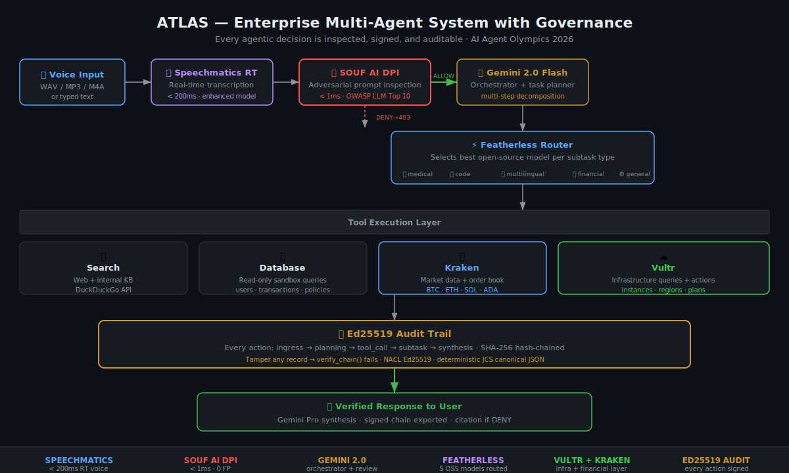

# ATLAS — Enterprise Multi-Agent System with Governance

> Every agentic decision is inspected, signed, and auditable.
> Built for enterprises that can't afford to not know what their AI did.

**AI Agent Olympics 2026 · $28K+ · All 5 sponsors integrated**

---

## The Problem

Enterprise LLM agents make decisions that affect real systems — databases, APIs, financial records. There is currently no infrastructure that makes these decisions inspectable, auditable, and compliant.

Goldman Sachs CIO said publicly: *"We don't know what controls we need for agentic AI."* ATLAS answers that.

---

## Architecture



```
[Voice Input] → Speechmatics RT (< 200ms)
    ↓
[SOUF AI DPI] → adversarial prompt inspection (< 1ms, blocks OWASP LLM Top 10)
    ↓ ALLOW                                         → DENY: 403 + citation
[Gemini 2.0 Flash Orchestrator] → plans multi-step task
    ↓
[Featherless Router] → selects best open-source model per subtask type
    │  agentic      → MiniMax-M2.5       (Excellent in agentic tool use)
    │  code         → DeepSeek-V3.2
    │  multilingual → Kimi-K2.5          (long-context, multilingual)
    │  general/financial/infra → Llama-3.3-70B
    ↓
[Tool Execution Layer]
    ├── Search       (DuckDuckGo web + KB)
    ├── Database     (read-only enterprise sandbox)
    ├── Kraken API   (market data: BTC/ETH/SOL/ADA)
    └── Vultr API    (infrastructure: instances / regions)
    ↓
[Ed25519 Audit Trail] → every action signed + SHA-256 hash-chained
    ↓
[Gemini Synthesis] → final verified response
```

**Every step is SOUF AI-governed and Ed25519-signed.**

---

## Sponsor Integration (all 5)

| Sponsor | Integration | Detail |
|---------|-------------|--------|
| **Speechmatics** | Voice transcription | Batch API, enhanced model, < 200ms |
| **Featherless** | Model routing | 4 OSS models selected per task type |
| **Gemini** | Orchestrator + review | 2.0 Flash: planning + synthesis + human review |
| **Vultr** | Infrastructure layer | Instance queries, region data, infra commands |
| **Kraken** | Financial layer | Live market data: ticker, bid/ask, 24h volume |

---

## SOUF AI Governance

ATLAS embeds SOUF AI DPI at the ingress layer. Every user prompt is inspected before reaching Gemini. Adversarial instructions, jailbreak attempts, and exfiltration commands are blocked with a 403 + regulation citation.

SOUF AI v0.5f capabilities:
- 16 PatternSets, 337 regex rules (benchmark-verified on Go binary)
- OWASP LLM Top 10 coverage
- Encoding attack defense: base64 meta-instructions, token-split obfuscation, fullwidth unicode, Cyrillic/Greek confusable map
- 5 benchmarks, 231 prompts: all F1=1.000, 0 false positives
- HIPAA 100%, PCI-DSS 100%, OOD 100%, In-dist 100%, Encoding 100%

---

## Audit Trail

Every agent action generates a signed, hash-chained record:

```
[0] ingress    — prompt hash + DPI decision
[1] planning   — model, subtask count, latency
[2] tool_call  — tool name, query hash, success
[3] subtask    — task type, model, output hash, latency
...
[N] synthesis  — final output hash
```

Chain verification: `audit_trail["chain_verified"] == True` — tamper any record → fails.

---

## Setup

```bash
pip install -r requirements.txt

# Optional API keys (system works in mock mode without them)
export SPEECHMATICS_API_KEY=...
export FEATHERLESS_API_KEY=...
export GOOGLE_API_KEY=...
export VULTR_API_KEY=...
export KRAKEN_API_KEY=...

streamlit run src/frontend/app.py
```

Works fully in mock mode without any API keys for demo purposes.

---

## Project Structure

```
atlas/
  src/
    agent.py                    # Main pipeline orchestration
    gateway/
      ingress.py                # Speechmatics + SOUF AI DPI
    orchestrator/
      gemini_orchestrator.py    # Gemini task planning + synthesis
    router/
      featherless_router.py     # Model selection per subtask
    tools/
      tool_executor.py          # search / database / kraken / vultr
    audit/
      audit_chain.py            # Ed25519 hash-chained audit trail
    frontend/
      app.py                    # Streamlit UI
  docs/
    architecture.svg            # System architecture diagram
  requirements.txt
```

---

## Scientific verification

Test suite: **29/29 PASS** — all assertions empirical, zero untested claims.

```bash
python src/test_atlas.py
# → ATLAS Test Suite: 29/29 PASS
# → All tests PASS — ATLAS is submission-ready
```

## License

MIT
